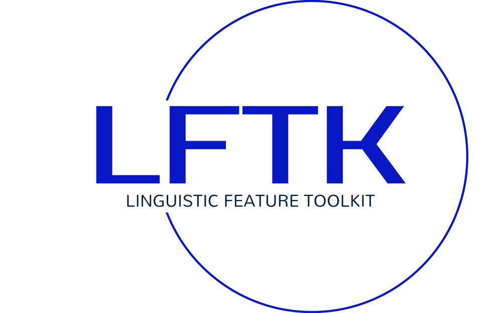

.. LFTK documentation master file, created by
   sphinx-quickstart on Mon Apr 24 22:19:16 2023.
   You can adapt this file completely to your liking, but it should at least
   contain the root `toctree` directive.

.. raw:: html
    
    </a>
    
Linguistic Feature ToolKit
================================

Press logo >>> to go to our GitHub repository

Contents
----------------

.. toctree::
    :maxdepth: 2

    start
    key
    features

Current Linguistic Features (Might take a few seconds to load)
----------------------------------------------------------------
Google Sheet of All Handcrafted Lingusitic Features link_.

.. _link: https://docs.google.com/spreadsheets/d/1uXtQ1ah0OL9cmHp2Hey0QcHb4bifJcQFLvYlVIAWWwQ/edit?usp=sharing

.. raw:: html

    <iframe src="https://docs.google.com/spreadsheets/d/e/2PACX-1vSQyAo2Uk1xPGc7ow88HYWYbkTRpHrZ4r2S6s7jFMDQATilliZD-Qecdn86TCg2pm3Bac64wXT6Mg1y/pubhtml?widget=true&amp;headers=false "width="1000" height="1000"></iframe>