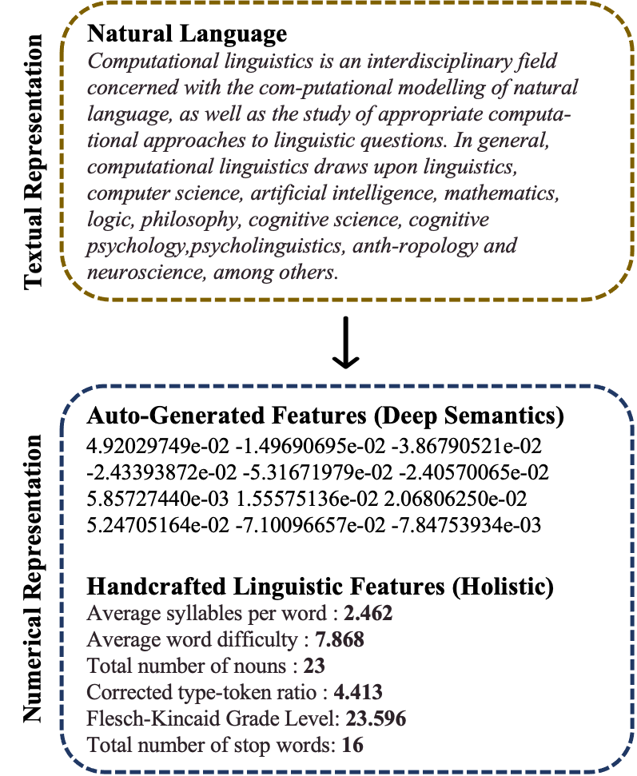

# Basic Walkthrough <-<-<- new users & returning users start here

Greetings, my fellow NLP enthusiasts. Welcome to LFTK, aka Linguistic Features ToolKit, an open-source feature extraction library. I have been building this library since 2022 to provide the community with the most comprehensive and up-to-date hancrafted linguistic feature extraction capabilities. Using [spaCy](https://spacy.io) as a sidekick, LFTK helps you extract a variety of features (more than 200 implemented features; Apr-26-2023). 

## Handcrafted Linguistic Features?

So, why would you need these "handcrafted linguistic features"? Trust me, you have already used them at some point in your NLP journey. In a 2023 paper that I introduced LFTK, I wrote, *"a handcrafted linguistic feature is a **single numerical value** produced by a **uniquely identifiable method** on **any natural language**"*. Indeed, that is the best definition that I can think of.

|Handcrafted vs Auto-generated|What defines a feature?|
|:-:|:-:|
|||

So really, a handcrafted linguistic feature is any single numeric that captures some intended linguistic properties. One example would be the *average number of numerals per sentence (feature key: a_num_ps)*.

## Usage

As above-mentioned, spaCy is LFTK's sidekick. So along with LFTK, you will need to install spaCy and one of it's pre-trained pipelines. To install libraries, use pip if possible.

```bash
pip install lftk
```

```bash
pip install spacy

python -m spacy download en_core_web_sm
```

Lets start by importing libraries and spaCy pipeline.

```python
import spacy
import lftk

# load a trained pipeline of your choice from spacy
# remember we already downloaed "en_core_web_sm" pipeline above?
nlp = spacy.load("en_core_web_sm")
```

Then, pass in your string to spaCy doc object.

```python
# create a spaCy doc object
doc = nlp("I love research but my professor is strange.")
```

Declare LFTK Extractor object.

```python
# initiate LFTK extractor by passing in doc
# you can pass in a list of multiple docs
LFTK = lftk.Extractor(docs = doc)
```

Now, extract whichever feature you want.

```python
# now, extract the handcrafted linguistic features that you need
# refer to them with feature keys
extracted_features = LFTK.extract(features = ["a_word_ps", "a_kup_pw", "n_noun"])
# {'a_word_ps': 8.0, 'a_kup_pw': 5.754, 'n_noun': 2}
```

## Programmatically Searching Handcrafted Features

```python
import lftk

# returns all available features as a list of dictionaries by default
searched_features = lftk.search_features()

# [{'key': 't_word', 'name': 'total_number_of_words', 'formulation': 'foundation', 'domain': 'surface', 'family': 'wordsent'}, {'key': 't_uword', 'name': 'total_number_of_unique_words', 'formulation': 'foundation', 'domain': 'surface', 'family': 'wordsent'}, {'key': 't_sent', 'name': 'total_number_of_sentences', 'formulation': 'foundation', 'domain': 'surface', 'family': 'wordsent'},...]
print(searched_features)

# specify attributes
searched_features = lftk.search_features(domain = "surface", family = "avgwordsent")

# [{'key': 'a_word_ps', 'name': 'average_number_of_words_per_sentence', 'formulation': 'derivation', 'domain': 'surface', 'family': 'avgwordsent'}, {'key': 'a_char_ps', 'name': 'average_number_of_characters_per_sentence', 'formulation': 'derivation', 'domain': 'surface', 'family': 'avgwordsent'}, {'key': 'a_char_pw', 'name': 'average_number_of_characters_per_word', 'formulation': 'derivation', 'domain': 'surface', 'family': 'avgwordsent'}]
print(searched_features)

# return pandas dataframe instead of list of dictionaries
searched_features = lftk.search_features(domain = 'surface', family = "avgwordsent", return_format = "pandas")

#   key                                             name formulation   domain       family
#4  a_word_ps       average_number_of_words_per_sentence  derivation  surface  avgwordsent
#5  a_char_ps  average_number_of_characters_per_sentence  derivation  surface  avgwordsent
#6  a_char_pw      average_number_of_characters_per_word  derivation  surface  avgwordsent
print(searched_features)
```

### Attribute: domain
- **surface** : surface-level features that often do not represent a specific linguistic property
- **lexico-semantics** : attributes associated with words
- **discourse** : high-level dependencies between words and sentences
- **syntax** : arrangement of words and phrases

### Attribute: family
- **wordsent** : basic counts of words and sentences
- **worddiff** : difficulty, familiarity, frequency of words
- **partofspeech** : features that deals with part of speech properties, we follow the [universal POS](https://universaldependencies.org/u/pos/) tagging scheme
- **entity** : named entities or entities such as location or person
- **avgwordsent** : averaging **wordsent** features over certain spans
- **avgworddiff** : averaging **worddiff** features over certain spans
- **avgpartofspeech**  : averaging **partofspeech** features over certain spans
- **avgentity** : averaging **entity** features over certain spans
- **lexicalvariation** : features that measure lexical variation (that are not TTR)
- **typetokenratio**  : type token ratio is known to capture lexical richness of a text
- **readformula** : traditional readability formulas that calculate text readability
- **readtimeformula** : basic reading time formulas (in seconds)

### Attribute: language
- **general** : LFTK can extract this feature in a language-agnostic manner when supplied with an appropriate spaCy pipeline
- **en** : LFTK can extract this feature in English only

## FAQ
### Q: How to extract features by group? Do I have to specify each feature individually?
No. We have a good way around, using the convenient search function. First, think about how you want to search for your handcrafted linguistic features. In this case, we only want **wordsent** family features that generally work across languages. 

```Python
import lftk

# specify attributes and (IMPORTANT) set return_format to "list_key"
searched_features = lftk.search_features(family = "wordsent", language = "general", return_format = "list_key")

#['t_word', 't_stopword', 't_punct', 't_uword', 't_sent', 't_char']
print(searched_features)
```
How is this possible? ```search_features``` function returns all available features by default and a user can restrict the returned features by specifying attributes. This is analogous to asking the function to "*return all features that are {**attribute 1**}, {**attribute 2**}, ...*" In the above case, "*return all features that are {**family = "wordsent"**}, {**language = "general"**}*".

Also, see how setting ```return_format``` variable to "list_key" returns a list of the feature keys that match the user-given attributes. Now, we pass those searched keys into ```extract``` function.

```Python
# now, extract the handcrafted linguistic features that you need
extracted_features = LFTK.extract(features = searched_features)

# {'t_word': 8, 't_stopword': 4, 't_punct': 1, 't_uword': 9, 't_sent': 1, 't_char': 36}
print(extracted_features)
```

### Q: What if I wanted to extract features from multiple groups?
```search_features``` function only allows users to pass one argument per attribute. This means that you will need to make multiple individual calls. For example, to obtain a list of features from **wordsent** family and **readtimeformula** family,

```Python
searched_features_A = lftk.search_features(family = "wordsent", return_format = "list_key")
searched_features_B = lftk.search_features(family = "readtimeformula", return_format = "list_key")

result = searched_features_A + searched_features_B
```

Then, you can call the usual extraction function,

```Python
extracted_features = LFTK.extract(features = result)