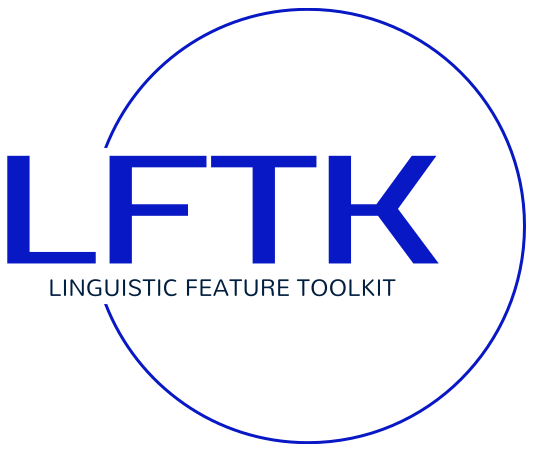
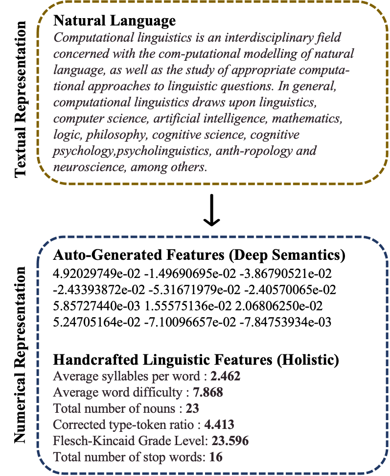
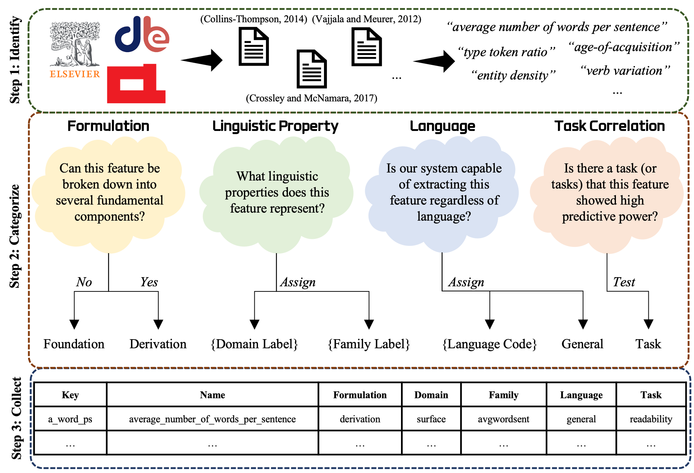

[](https://spacy.io)
</a>
</a>
</a>
</a>


# LFTK

- **:microscope: Comprehensive**: LFTK is a Python research package that extracts various handcrafted features (e.g. number of words per sentence, Flesch-Kincaid Readabiility Score) that are commonly used in computational linguistics. 
- **:fire: Blazing Fast**: Extracting more than 200 handcrafted features takes less than 0.01 sec per word. Much faster than LFTK's predecessor, [LingFeat](https://github.com/brucewlee/lingfeat). This time is reported excluding spaCy processing time, which is not contained in LFTK.
- **:rocket: Do More with SpaCy**: LFTK is built on top of a popular NLP library named [spaCy](https://spacy.io). Explore spaCy's pre-trained pipelines and get the most out of spaCy.

LFTK can calculate readability score, evaluate word difficulty, count number of nouns, and many more. There is much to explore in this package. Use our handcrafted features to support linguistic studies or build machine learning models.



## Installation
Use package manager [pip](https://pip.pypa.io/en/stable/) to install LFTK. 

```bash
pip install lftk
```

Also, install spaCy and a [trained spaCy pipeline of your choice](https://spacy.io/usage). Here, we use ```en_core_web_sm```. Though instaling LFTK can automatically install spaCy, but you will still have to download one of their trained pipelines.

```bash
pip install spacy

python -m spacy download en_core_web_sm
```

## News
- v.1.0.8 -> 7 features that extracts conjunctions are deleted. These features are replaced by those extractin subordinating conjunctions and coordinating conjunections.

## Usage

```python
import spacy
import lftk

# load a trained pipeline of your choice from spacy
# remember we already downloaed "en_core_web_sm" pipeline above?
nlp = spacy.load("en_core_web_sm")

# create a spaCy doc object
doc = nlp("I love research but my professor is strange.")

# initiate LFTK extractor by passing in doc
# you can pass in a list of multiple docs
LFTK = lftk.Extractor(docs = doc)

# optionally, you can customize how LFTK extractor calculates handcrafted linguistic features
# for example, include stop word? include puncutaion? maximum decimal digits?
LFTK.customize(stop_words=True, punctuations=False, round_decimal=3)

# now, extract the handcrafted linguistic features that you need
# refer to them as feature keys
extracted_features = LFTK.extract(features = ["a_word_ps", "a_kup_pw", "n_noun"])

# {'a_word_ps': 8.0, 'a_kup_pw': 5.754, 'n_noun': 2}
print(extracted_features)
```
Also, read [Essential Tips and To-Do Guides](#essential-tips-and-to-do-guides).

## Deep Dive: Handcrafted Linguistic Features

TL;DR: [Google Sheet of All Handcrafted Lingusitic Features](https://docs.google.com/spreadsheets/d/1uXtQ1ah0OL9cmHp2Hey0QcHb4bifJcQFLvYlVIAWWwQ/edit?usp=sharing)

Each handcrafted linguistic feature represents a certain linguistic property. We categorize all features into the broad linguistic branches of **lexico-semantics**, **syntax**, **discourse**, and **surface**. The **surface** branch can also hold features that do not belong to any specific linguistic branch. Apart from linguistic branches, handcrafted features are also categorized into linguistic families. The linguistic families are meant to group features into smaller subcategories, enabling users to search more effectively for the feature they need. All family names are unique, and each family belongs to a specific formulation. This means that the features in a family are either all foundation or all derivation. A linguistic family also serves as an important building block of our feature extraction system. LFTK as a program is essentially a linked collection of several feature extraction modules where each module represents a linguistic family.



Each handcrafted linguistic feature can either foundation or derivation. Derivation-type linguistic features are derived on top of foundation-type linguistic features. For example, the *total number of words* and the *total number of sentences* in a given text is a foundation feature. On the other hand, the *average number of words per sentence* is a derivation feature as it builds on top of the two aforementioned foundation features.

Each handcrafted linguistic feature also has an assigned language value. If the linguistic feature is universally applicable across languages, it is denoted "general". These general linguistic features can be used with any language given that spaCy has a supporting pipeline for that functionality in that language. This can be easily checked on [spaCy pipelines](https://universaldependencies.org/u/pos/). If the feature is designed for a specific language, like English, it is denoted with the specific language code.

### Programmatically Searching Handcrafted Features

```python
import lftk

# returns all available features as a list of dictionaries by default
searched_features = lftk.search_features()

# [{'key': 't_word', 'name': 'total_number_of_words', 'formulation': 'foundation', 'domain': 'surface', 'family': 'wordsent'}, {'key': 't_uword', 'name': 'total_number_of_unique_words', 'formulation': 'foundation', 'domain': 'surface', 'family': 'wordsent'}, {'key': 't_sent', 'name': 'total_number_of_sentences', 'formulation': 'foundation', 'domain': 'surface', 'family': 'wordsent'},...]
print(searched_features)

# specify attributes
searched_features = lftk.search_features(domain = "surface", family = "avgwordsent")

# [{'key': 'a_word_ps', 'name': 'average_number_of_words_per_sentence', 'formulation': 'derivation', 'domain': 'surface', 'family': 'avgwordsent'}, {'key': 'a_char_ps', 'name': 'average_number_of_characters_per_sentence', 'formulation': 'derivation', 'domain': 'surface', 'family': 'avgwordsent'}, {'key': 'a_char_pw', 'name': 'average_number_of_characters_per_word', 'formulation': 'derivation', 'domain': 'surface', 'family': 'avgwordsent'}]
print(searched_features)

# return pandas dataframe instead of list of dictionaries
searched_features = lftk.search_features(domain = 'surface', family = "avgwordsent", return_format = "pandas")

#   key                                             name formulation   domain       family
#4  a_word_ps       average_number_of_words_per_sentence  derivation  surface  avgwordsent
#5  a_char_ps  average_number_of_characters_per_sentence  derivation  surface  avgwordsent
#6  a_char_pw      average_number_of_characters_per_word  derivation  surface  avgwordsent
print(searched_features)
```

### Attribute: domain
- **surface** : surface-level features that often do not represent a specific linguistic property
- **lexico-semantics** : attributes associated with words
- **discourse** : high-level dependencies between words and sentences
- **syntax** : arrangement of words and phrases

### Attribute: family
- **wordsent** : basic counts of words and sentences
- **worddiff** : difficulty, familiarity, frequency of words
- **partofspeech** : features that deals with part of speech properties, we follow the [universal POS](https://universaldependencies.org/u/pos/) tagging scheme
- **entity** : named entities or entities such as location or person
- **avgwordsent** : averaging **wordsent** features over certain spans
- **avgworddiff** : averaging **worddiff** features over certain spans
- **avgpartofspeech**  : averaging **partofspeech** features over certain spans
- **avgentity** : averaging **entity** features over certain spans
- **lexicalvariation** : features that measure lexical variation (that are not TTR)
- **typetokenratio**  : type token ratio is known to capture lexical richness of a text
- **readformula** : traditional readability formulas that calculate text readability
- **readtimeformula** : basic reading time formulas (in seconds)

### Attribute: language
- **general** : LFTK can extract this feature in a language-agnostic manner when supplied with an appropriate spaCy pipeline
- **en** : LFTK can extract this feature in English only

## Essential Tips and To-Do Guides
### Q: How to extract features by group? Do I have to specify each feature individually?
No. We have a good way around, using the convenient search function. First, think about how you want to search for your handcrafted linguistic features. In this case, we only want **wordsent** family features that generally work across languages. 

```Python
import lftk

# specify attributes and (IMPORTANT) set return_format to "list_key"
searched_features = lftk.search_features(family = "wordsent", language = "general", return_format = "list_key")

#['t_word', 't_stopword', 't_punct', 't_uword', 't_sent', 't_char']
print(searched_features)
```
How is this possible? ```search_features``` function returns all available features by default and a user can restrict the returned features by specifying attributes. This is analogous to asking the function to "*return all features that are {**attribute 1**}, {**attribute 2**}, ...*" In the above case, "*return all features that are {**family = "wordsent"**}, {**language = "general"**}*".

Also, see how setting ```return_format``` variable to "list_key" returns a list of the feature keys that match the user-given attributes. Now, we pass those searched keys into ```extract``` function.

```Python
# now, extract the handcrafted linguistic features that you need
extracted_features = LFTK.extract(features = searched_features)

# {'t_word': 8, 't_stopword': 4, 't_punct': 1, 't_uword': 9, 't_sent': 1, 't_char': 36}
print(extracted_features)
```

### Q: What if I wanted to extract features from multiple groups?
```search_features``` function only allows users to pass one argument per attribute. This means that you will need to make multiple individual calls. For example, to obtain a list of features from **wordsent** family and **readtimeformula** family,

```Python
searched_features_A = lftk.search_features(family = "wordsent", return_format = "list_key")
searched_features_B = lftk.search_features(family = "readtimeformula", return_format = "list_key")

result = searched_features_A + searched_features_B
```

Then, you can call the usual extraction function,

```Python
extracted_features = LFTK.extract(features = result)
```